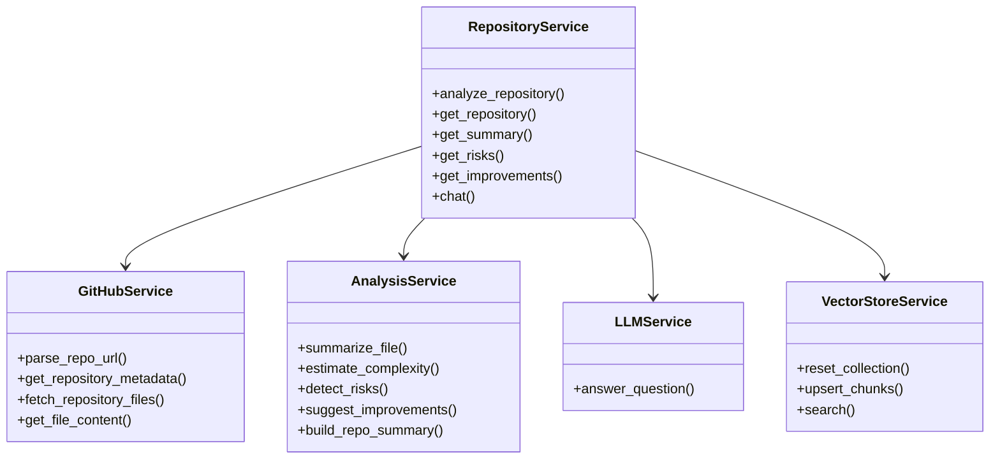
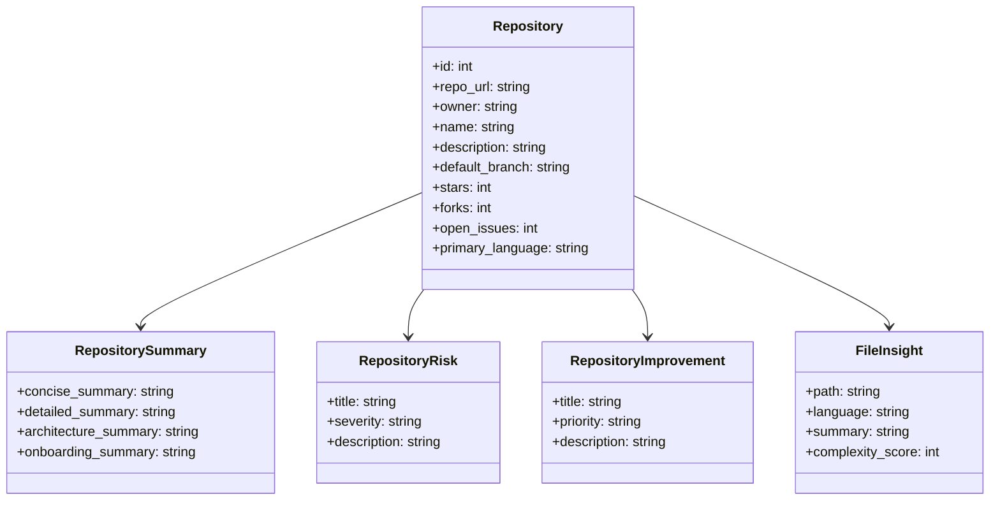
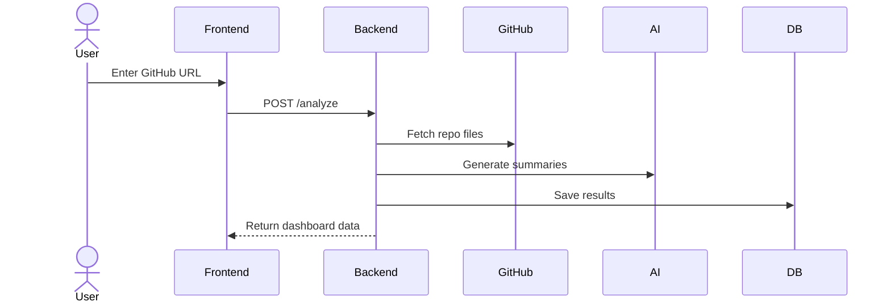

# CodeLens AI — Design Document

## 1. Overview

CodeLens AI is a full-stack AI-powered GitHub Repository Analyzer that helps users quickly understand unfamiliar repositories by generating intelligent summaries, architecture insights, risk reports, improvement suggestions, and file-level insights.

The platform reduces manual repository review time from hours to minutes using automation, AI summarization, and repository intelligence.

---

## 2. Problem Statement

Developers, recruiters, and engineering managers often need to understand unfamiliar codebases quickly.

### Current Pain Points

- Reading hundreds of files manually  
- Slow onboarding into new repositories  
- Difficulty understanding architecture  
- Hidden maintainability risks  
- No quick technical summaries  

CodeLens AI solves this by automatically analyzing repositories and presenting actionable insights.

---

## 3. Goals

### Functional Goals

- Accept public GitHub repository URLs  
- Fetch repository metadata and source files  
- Generate AI-powered summaries  
- Detect risks and code quality issues  
- Suggest improvements  
- Provide file-level insights  
- Present results in an interactive dashboard  

### Non-Functional Goals

- Fast response time  
- Scalable architecture  
- Clean UI/UX  
- Cloud deployable  
- Maintainable codebase  

---

## 4. High-Level Architecture

```text
User
 ↓
React Frontend
 ↓
FastAPI Backend API
 ↓
Repository Service Layer
 ↓
GitHub API + AI Engine
 ↓
Database
```
## Class diagram

## Data Model Class Diagram

## Request / Response Flow Diagram

